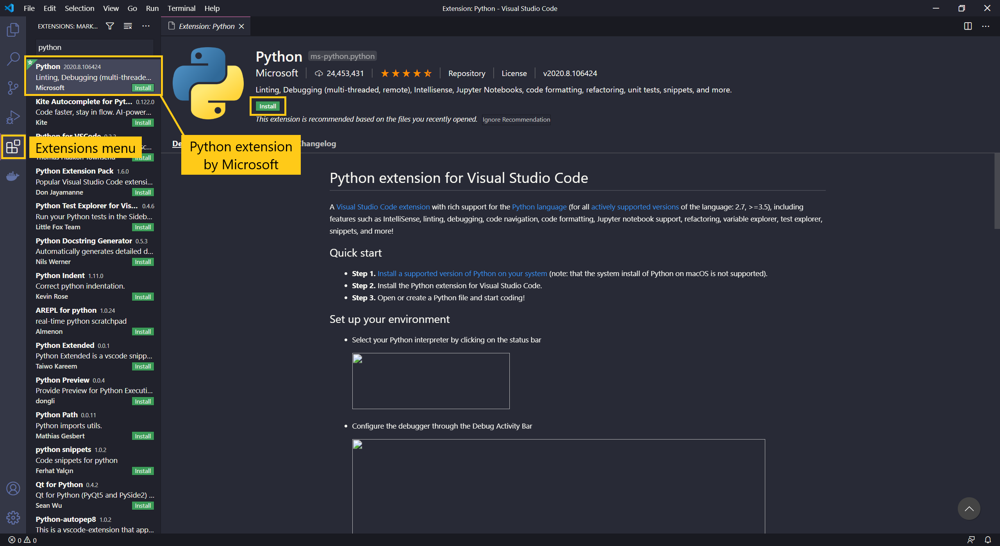
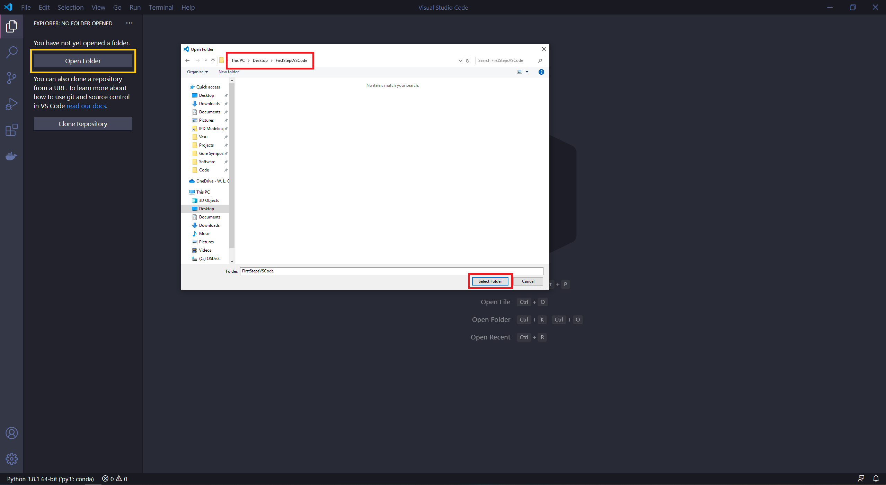
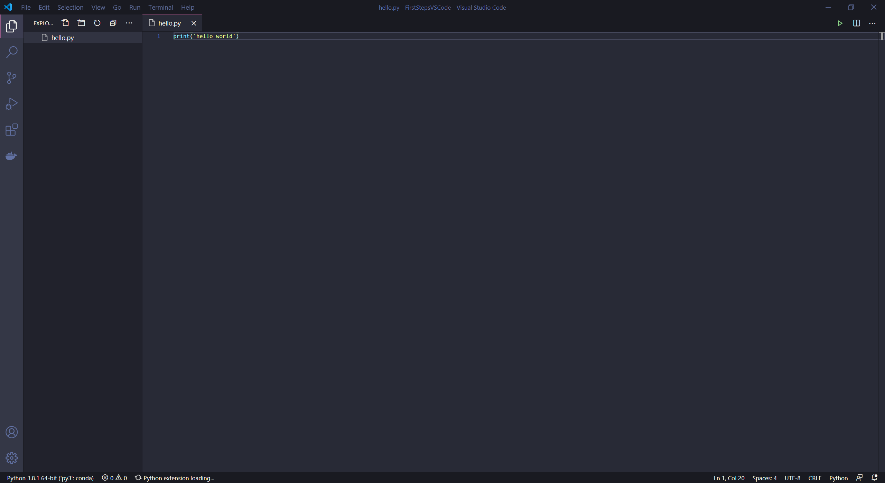
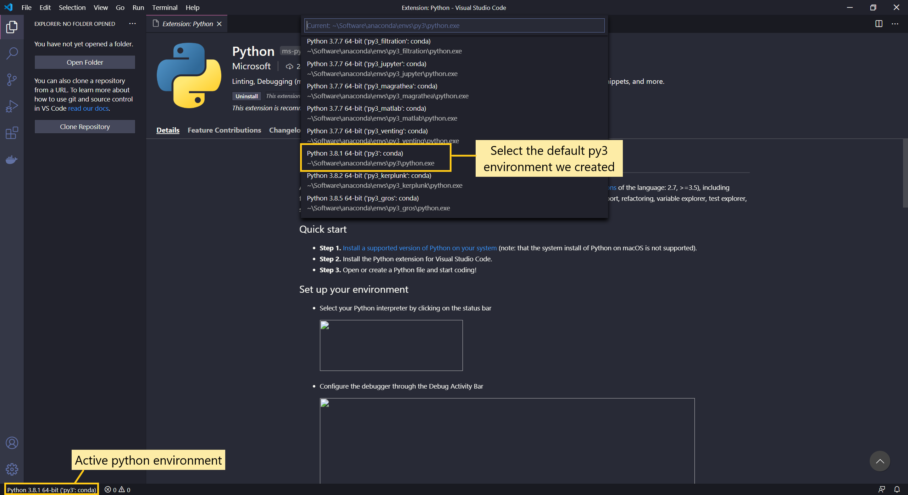
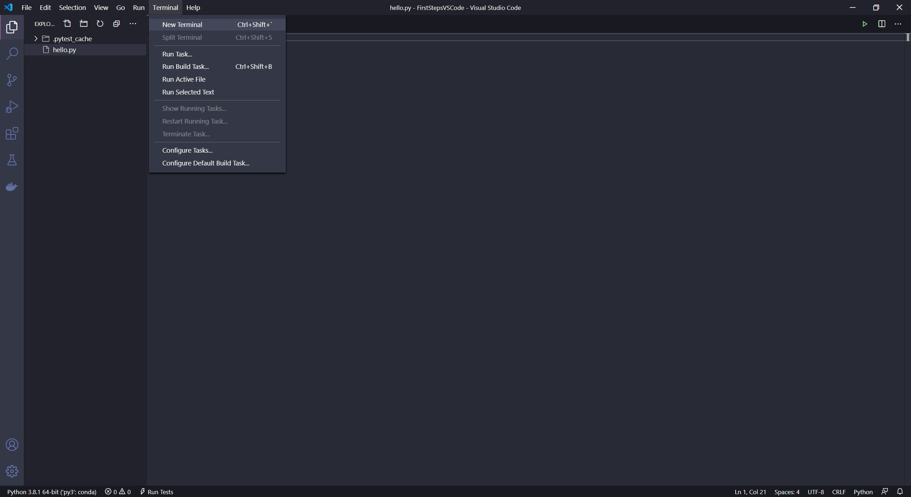
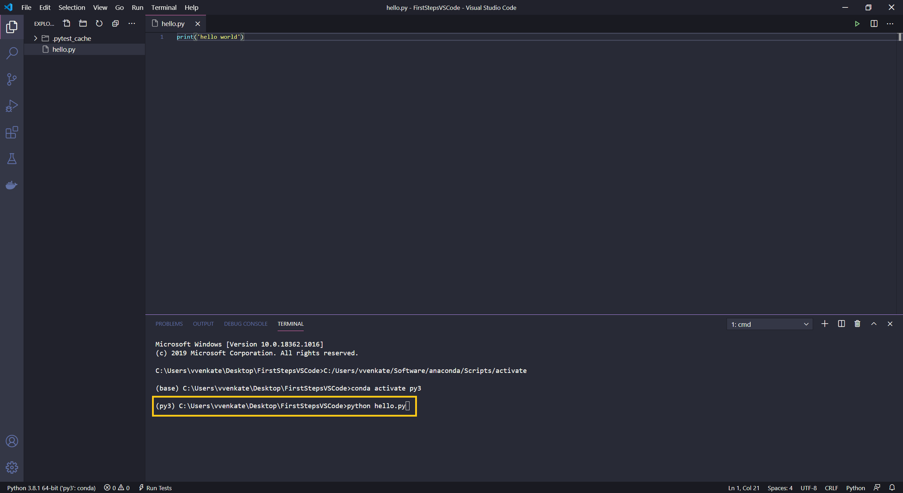
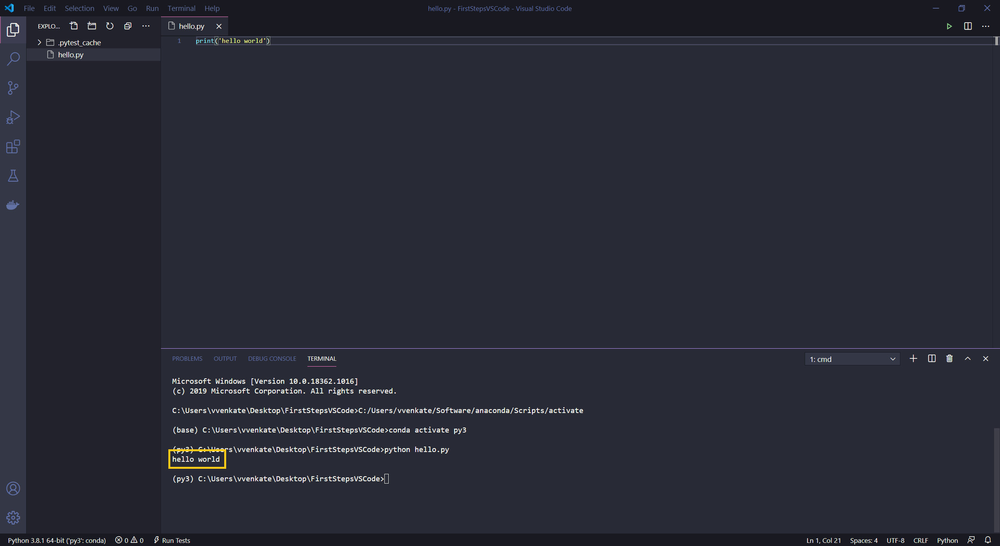

# First steps in python with VS Code

## Installing the python extension
That process wasn't so bad, but working with Python gets a lot easier with
the Python extension created by Microsoft. To install the extension, open
up the extension menu on the left (the icon looks like a square inside of
a square) and search Python.

After installing, you might need to reload, so go ahead and do that.

## Create a folder for your code

To get started I recommend creating a folder on your Desktop (or a directory
that you're comfortable with) to put your Python files in for now. With that
directory created, now open up Visual Studio Code. Open the directory that
you created using the `Open Folder` option in the `File` menu of `VS Code`.

With the directory open, you can create your first python file (.py extension)
with some code to print "Hello World".

## Activating the correct conda environment
The python extension activates automatically once you open any file containing
python code. Once the extension activates, you should see the current
environment on the bottom left as shown below.

If you click on the name, a list of environments should open. Please select 
the `py3` environment that you created. 

Never use the `base` environment. The `base` environment has only 
the `conda` package manager and we do not want to mess this up.

## Running code in built-in Terminal

Now that you have your Hello World code ready, we can run it by using the
built-in temrinal in VS Code. If if is not open already, you can open it
by going to the `Terminal` menu and selecting `New Terminal`.

The terminal that you just opened will automatically start in the current
directory that you are editing in VS Code. This is exactly why we created
and opened a directory before getting started. If you open individual files
through VSCode instead of a folder, the command line will start in your `HOME`
folder. You will need to navigate to it manually using the `cd` command. If
the python extension is installed correctly and active, then the terminal
should automatically activate the selected `conda` environment as well.
If not you can manually activate the correct environment using `conda activate`
command.

You can now run the script running `python hello.py` in the terminal

## Run output

The output is printed on the terminal

